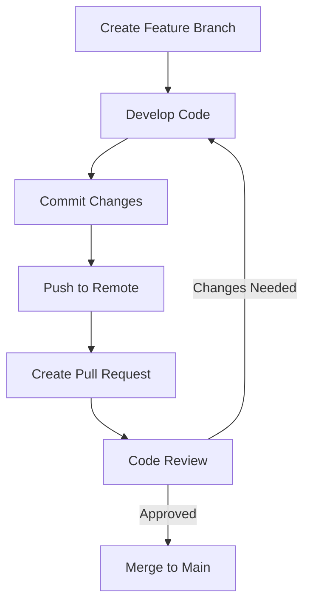

# Compiler-Backend

This project implements a compiler backend for a simple grammar that processes basic arithmetic expressions involving addition and multiplication. It transforms input expressions into an Abstract Syntax Tree (AST), generates intermediate three-address code, applies optimizations, and produces a simple assembly-like target code. The implementation is in Python, with version control managed by Git and environment consistency provided by Docker for reproducible development and deployment.

## Project Structure

- `src/`: Contains the core source code for the compiler, including modules for parsing, semantic analysis, intermediate code generation, optimization, and target code generation.
- `tests/`: Includes unit tests for validating the functionality of compiler components.
- `frontend/`: Houses the web-based frontend for user interaction with the compiler, including HTML, CSS, and JavaScript files.
- `Dockerfile`: Defines the Docker image configuration for creating a consistent development environment.
- `docker-compose.yaml`: Configuration file for Docker Compose to simplify building and running the project containers.
- `run_tests.py`: Script to execute all unit tests in the project.
- `run_docker_test.sh` & `run_docker_compose_test.sh`: Scripts for testing the compiler backend API within Docker environments.

## Grammar

The simple grammar used is for arithmetic expressions:
- E -> E + T | T
- T -> T * F | F
- F -> (E) | number

## Implemented Functionality

The compiler backend processes arithmetic expressions through a multi-stage pipeline:
1. **Parsing**: Interprets input strings based on the grammar (E -> E + T | T, T -> T * F | F, F -> (E) | number) to build an Abstract Syntax Tree (AST) representing the expression structure.
2. **Semantic Analysis**: Performs basic validation of the AST (currently minimal due to the simplicity of the grammar, with no type checking required).
3. **Intermediate Code Generation**: Converts the AST into three-address code, a linear representation where each operation involves at most three operands, facilitating further processing.
4. **Optimization**: Applies optimizations such as constant folding to the intermediate code, evaluating constant expressions at compile-time to reduce runtime computations (e.g., "5 + 3" becomes "8").
5. **Target Code Generation**: Transforms the optimized intermediate code into a simple assembly-like format with instructions like LOAD, ADD, MUL, STORE, and MOV, simulating low-level operations.

## Setup and Running the Project

### Local Environment Setup
1. **Install Dependencies**: If running locally without Docker, install the required Python packages.
   ```bash
   pip install ply
   ```
2. **Run the Compiler**: Execute the main script to interact with the compiler.
   ```bash
   python src/main.py
   ```
   - Enter arithmetic expressions like `1 + 2` or `(3 + 4) * 5` at the prompt.
   - Type `exit` to quit.

3. **Run Tests**: Execute the test suite to verify functionality.
   ```bash
   python run_tests.py
   ```

### Docker Environment Setup
You can use either direct Docker commands or Docker Compose for a simplified process. Note that the Docker environment now uses Python 3.11 for enhanced features and compatibility.

#### Using Docker Commands
1. **Build and Run Container**: Use Docker for a consistent environment with all dependencies.
   ```bash
   docker build -t compiler-backend .
   docker run -it compiler-backend bash
   ```
2. **Inside Container**: Run the compiler or tests.
   - To run the compiler:
     ```bash
     python src/main.py
     ```
   - To run tests:
     ```bash
     python run_tests.py
     ```

#### Using Docker Compose (Recommended)
1. **Build and Run with Docker Compose**: Use the provided `docker-compose.yaml` to simplify the process.
   ```bash
   docker-compose up --build
   ```
   This command builds the image if necessary and starts a container with an interactive shell.
2. **Inside Container**: Run the compiler or tests as described above.
3. **Stop the Container**: When done, stop the container with:
   ```bash
   docker-compose down
   ```

## Collaborative Development

This section provides guidelines for team members to collaborate effectively on the Compiler-Backend project, ensuring code quality, consistency, and smooth integration.

### Environment Setup with Docker
- **Consistency**: Use Docker to ensure all developers work in the same environment, avoiding "works on my machine" issues. The project is configured to use Python 3.11 in the Docker image.
- **Using Docker Compose**: Prefer Docker Compose for simplicity. Run `docker-compose up --build` to start the development environment. This mounts the project directory, allowing live code changes.

### Code Review Process
- **Pull Requests**: Before merging code into the main branch, create a pull request (PR) on the repository. Assign relevant team members for review.
- **Review Guidelines**: Reviewers should check for code quality, adherence to project style, functionality, and test coverage. Provide constructive feedback and suggest improvements.
- **Approval**: Code should only be merged after at least one approval from a team member, ensuring multiple eyes on critical changes.

### Testing Guidelines
- **Mandatory Testing**: All code changes must pass the unit tests before merging. Run tests with `python run_tests.py` inside the Docker container or locally.
- **Writing Tests**: When adding new functionality, include corresponding unit tests in the `tests/` directory to maintain coverage and reliability.
- **Automation**: If possible, set up CI/CD pipelines to automatically run tests on pull requests, ensuring stability.

### Running the Project
- **Interactive Mode**: Run the compiler with `python src/main.py` to interact with it. Input arithmetic expressions like `1 + 2 * 3` and see the compilation stages output.
- **Exit**: Type `exit` to quit the interactive mode.

### Collaborative Workflow Diagram
Below is a visual representation of the collaborative development workflow:



## Development

- **Code Structure**: The project is modular with separate components for parsing, semantic analysis, intermediate code generation, optimization, and target code generation. Each module is documented with comments explaining its purpose and functionality.

### Debugging

- **Logging**: Add print statements or use a logging library to output intermediate results or error messages during development. This can help trace the flow of data through the compiler stages.
- **Unit Tests**: Use failing unit tests to isolate issues. Run specific tests with `python -m unittest tests.test_compiler.TestCompiler.test_specific_method` to focus on problematic areas.
- **Interactive Debugging**: Use a debugger like `pdb` for Python. Insert `import pdb; pdb.set_trace()` at suspected points in the code to pause execution and inspect variables.
- **Docker Debugging**: If using Docker, attach to the running container with `docker exec -it <container_name> bash` to access the environment and run debugging commands.

## Frontend

A web-based frontend has been developed for interacting with the compiler backend, allowing users to input arithmetic expressions and view the compilation results through a user-friendly interface.

### Frontend Structure
- **Directory**: `frontend/`
- **Main File**: `frontend/index.html` - The primary interface for user interaction with the compiler.
- **Test File**: `frontend/test_usability.html` - A test interface for evaluating frontend usability.

### Frontend Content
- **Input Field**: Allows users to enter arithmetic expressions (e.g., `1 + 2 * 3`).
- **Compile Button**: Triggers the compilation process by sending the input expression to the backend API.
- **Results Display**: Shows the compilation results in four sections:
  - **Abstract Syntax Tree (AST)**: The parsed structure of the expression.
  - **Intermediate Code**: The three-address code representation.
  - **Optimized Code**: The intermediate code after optimizations like constant folding.
  - **Target Code**: The final assembly-like code.

The frontend is built using Vue.js, included via a CDN for simplicity, avoiding complex build tools and ensuring a lightweight setup.

### Starting the Frontend and Backend
- **Frontend**: Open `frontend/index.html` directly in a web browser to access the compiler interface. No additional setup or server is required for the frontend.
- **Backend API**: The backend must be running to process compilation requests. Use Docker Compose to start the API service:
  ```bash
  docker-compose up --build compiler-backend-api
  ```
  This command builds and starts the Flask API server on port 5000, which handles requests from the frontend.

Ensure the backend API is running before using the frontend to compile expressions. If you need to stop the backend service, use:
```bash
docker-compose down
```

## Using Sequential Thinking for Problem Solving

To enhance problem-solving and decision-making during development, you can leverage the Sequential Thinking tool provided by the Model Context Protocol (MCP) server. This tool assists in breaking down complex problems into manageable steps, allowing for dynamic and reflective analysis.

- **Accessing the Tool**: Use the MCP server 'sequential-thinking' with the tool name 'sequentialthinking'. This tool is available when connected to the MCP environment.
- **When to Use**: Ideal for complex debugging, planning new features, or resolving architectural challenges. It helps in scenarios where the problem scope isn't immediately clear or requires multi-step solutions.
- **How to Use**: Invoke the tool with a specific thought or problem statement. Parameters include:
  - `thought`: Your current analysis or question.
  - `nextThoughtNeeded`: Set to `true` if further analysis is required.
  - `thoughtNumber` and `totalThoughts`: Track the progression of your thinking process.
  - Other parameters like `isRevision` or `branchFromThought` allow revisiting or branching thoughts for deeper exploration.
- **Benefits**: This tool supports revising previous thoughts, expressing uncertainty, generating hypotheses, and verifying solutions, ensuring a thorough approach to problem-solving.

Example usage might involve starting with an initial thought about a bug, estimating the steps needed to resolve it, and iteratively refining your approach based on new insights or test results.

## License

MIT
